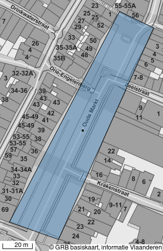
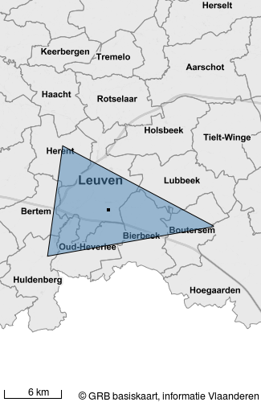

Introduction
============

The goal of this Static Map Generator (SMG) is to generate static maps
that are composed of:

-   different geographical formats like GeoJSON
-   a background layer like WMS
-   layout-overlays like Text, and Scale.

Based on a configuration file, the SMG renders all individual layers to
a temporary image.

The image will contain a scale bar.

The image can be returned as a steam or a base64 format.

Use
---

### As a Library

-   Import Generator from static\_map\_generator.generator
-   Create a configuration file
-   Generator.generate\_stream('config')
    or Generator.generate\_base64('config')

### As a Service

-   POST the config-file (json) to the REST endpoint:
    <http://localhost:6543/maps>
-   The service returns the generated image as a stream or base64
    depending on the Accept header.

Example
-------

Let's clarify this with examples:

### Library

```python
# -*- coding: utf-8 -*-
import os
from static_map_generator.generator import Generator


examples = [
    {
        "name": "map_simple_example_1.png",
        "coordinates": [
            [
                [173226.56, 174184.28],
                [173300.48, 174325.52],
                [173323.41, 174314.54],
                [173259.49, 174172.57],
                [173226.56, 174184.28]
            ]
        ]
    }, {
        "name": "map_simple_example_2.png",
        "coordinates": [
            [
                [169839.02, 178535.12],
                [168247.34, 166934.73],
                [185701.87, 170037.16],
                [185701.87, 170118.09],
                [169839.02, 178535.12]
            ]
        ]
    }
]

for example in examples:
    config_simple = {
      "params": {
        "width": 325,
        "height": 500
      },
      "layers": [
        {
          "geojson": {
            "coordinates": example["coordinates"],
            "type": "Polygon"
          },
          "type": "geojson"
        },
        {
          "type": "text",
          "text": "© GRB basiskaart, informatie Vlaanderen",
          "gravity": "south_east",
          "font_size": 3
        },
        {
          "type": "wms",
          "url": "http://geoservices.informatievlaanderen.be/raadpleegdiensten/GRB-basiskaart-grijs/wms?",
          "layers": "GRB_BSK_GRIJS"
        }
      ]
    }

    with open(os.path.join(os.path.dirname(__file__), example["name"]), 'wb') as f:
        f.write(Generator.generate_stream(config_simple))
```

Example 1:  Example 2:


### Service

Create image


**Example request**:

```http
POST /maps HTTP/1.1
Host: http://localhost:6543
Accept: application/octet-stream
Content-Type: application/json
OpenAmSSOID: AQIC5wM2LY4Sfcz_rOiD3t033xN0-E5ItHoSUOU.*

{
  "params": {
    "width": 650,
    "height": 1000
  },
  "layers": [
    {
      "geojson": {
        "coordinates": [
            [
                [173226.56, 174184.28],
                [173300.48, 174325.52],
                [173323.41, 174314.54],
                [173259.49, 174172.57],
                [173226.56, 174184.28]
            ]
        ],
        "type": "Polygon"
      },
      "type": "geojson"
    },
    {
      "type": "text",
      "text": "© GRB basiskaart, informatie Vlaanderen",
      "gravity": "south_east",
      "font_size": 4
    },
    {

      "type": "wms",
      "url": "http://geoservices.informatievlaanderen.be/raadpleegdiensten/GRB-basiskaart-grijs/wms?",
      "layers": "GRB_BSK_GRIJS"
    }
  ]
}
    
```

Configuration
-------------

The configuration is a json-object existing out of 2 basic keys:

Key        Description                             Type     Mandatory
---------- --------------------------------------- -------- -----------
'params'   general parameters for the final map    Object   True
'layers'   an array of 'layer' for the final map   Array    True

### params-object

| Key      | Description               | Type     | Mandatory |  Example
| -------- | ------------------------- | -------- | ----------| ---------
| 'width'  | width for the output map  | Integer  | True      | 500
| 'height' | height for the output map | Integer  | True      | 500

### layer-object

The parameters for each layer differ based on the type of layer:

#### WMS

|Key      |  Description                           | Type   |  Mandatory  | Example
|-------- |  ------------------------------------- | ------ |  ---------- | --------------------------------------------------
|'type'   |  Type of layer                         | String |  True       | 'wms'
|'url'    |  url of the wms-service                | String |  True       | '<https://geo.onroerenderfgoed.be/geoserver/wms>?'
|'layers' |  layernames to be used in wms-service  | String |  True       | 'vioe\_geoportaal:landschapsbeheersplannen'

Notice: Next to these parameters, other supported parameters of the
wms-service can be given, f.e featureid, bgcolor, transparant, ...

#### GeoJSON

| Key       |  Description                 | Type     | Mandatory | Example
| ----------| -----------------------------| -------- | ----------|  ---------------------------------------------------------------------------------------------------------------------------------------------------------
| 'type'    | Type of layer                |  String  |  True     |  'geojson'
| 'geojson' | geojson-notation of geometry |  String  |  True     |  {'crs': {'type': 'name', 'properties': {'name': 'EPSG:31370'}}, 'type': 'MultiPoint', 'coordinates': \[\[103912.03, 192390.11\],\[103500, 192390.11\]\]}

#### Text

|Key          |  Description                                      |  Type    |  Mandatory |   Example
|-------------| --------------------------------------------------| ---------|----------- |------------------
|'type'       | Type of layer                                     | String   |True        |'text'
|'text'       | Text to be used for the layer                     | String   |True        |'This is a test'
|'font\_size' | Font size                                         | Integer  |True        |24
|'gravity'    | Gravity                                           | String   |True        |'south\_east'

Development
-----------

- Installation of Mapnik required:

    -   Easiest way is to use following [docker
        container](https://hub.docker.com/r/akx0/mapnik/~/dockerfile/)
        (or the commands in this).
    -   The virtualenv can be created with required requirements
        of static\_map\_generator.
    -   Then add mapnik python binding by
        pip install -e /opt/python-mapnik

- Make sure the /tmp folder is cleaned on regular basis (The cleaning of
/tmp is done by the upstart script /etc/init/mounted-tmp.conf. The
script is run by upstart everytime /tmp is mounted. Practically that
means at every boot.) Manik is now available on your machine and
executable from a virtual python environment.

```.sourceCode .bash
 $ pip install -r requirements-dev.txt
 $ python setup.py develop
 $ pserve development.ini
```

We try to cover as much code as we can with unit tests. You can run them
using [tox](http://tox.testrun.org) or directly through pytest. When
providing a pull request, please run the unit tests first and make sure
they all pass.

```.sourceCode .bash
$ tox
# No coverage
$ py.test
# Coverage
$ py.test --cov static_map_generator --cov-report term-missing
# Only run a subset of the tests
$ py.test static_map_generator/tests/test_renderer.py
```
